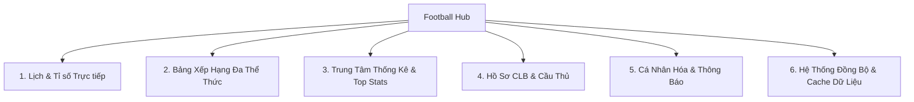
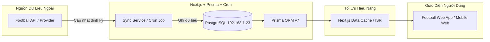

# ⚽ ĐỀ ÁN & Ý TƯỞNG TÍNH NĂNG: FOOTBALL LIVE & STATS HUB
> **Hệ thống Cập nhật Lịch thi đấu, Tỉ số Trực tiếp & Thống kê 8 Giải đấu Hàng đầu Châu Âu**

---

## 🏆 I. PHẠM VI 8 GIẢI ĐẤU TRỌNG TÂM

Dự án tập trung toàn diện vào **8 giải đấu bóng đá đỉnh cao** được người hâm mộ quan tâm nhất thế giới:

```
├── 🏴󠁧󠁢󠁥󠁮󠁧󠁿 1. Premier League (Ngoại Hạng Anh)
├── 🇪🇸 2. La Liga (VĐQG Tây Ban Nha)
├── 🇮🇹 3. Serie A (VĐQG Ý)
├── 🇩🇪 4. Bundesliga (VĐQG Đức)
├── 🇫🇷 5. Ligue 1 (VĐQG Pháp)
├── 🌟 6. UEFA Champions League (Cúp C1 Châu Âu)
├── 🥈 7. UEFA Europa League (Cúp C2 Châu Âu)
└── 🥉 8. UEFA Conference League (Cúp C3 Châu Âu)
```

---

## 🎯 II. CÁC PHÂN HỆ CHỨC NĂNG CHÍNH (FEATURE BREAKDOWN)



---

### 1. 📅 Phân Hệ Lịch Thi Đấu & Kết Quả (Match & Live Center)

*Đây là "trái tim" của ứng dụng, nơi người dùng truy cập nhiều nhất mỗi ngày.*

- **Bộ lọc thông minh (Multi-filtering):**
  - Xem theo **Ngày** (Hôm nay, Hôm qua, Ngày mai, Lịch theo tuần/tháng với Date Picker trực quan).
  - Lọc nhanh theo **Giải đấu** (Tabs biểu tượng 8 giải đấu có huy hiệu nhận diện).
  - Bộ lọc trạng thái: `Tất cả` | `Đang đá (Live)` | `Sắp diễn ra` | `Đã kết thúc`.
- **Live Match Ticker (Tỉ số Thời gian thực):**
  - Hiển thị phút thi đấu hiện tại (`45+2'`, `HT`, `90+4'`, `FT`).
  - Hiệu ứng nhấp nháy / animation khi có bàn thắng mới hoặc thẻ đỏ.
  - Tự động làm mới dữ liệu (Auto-refresh) mỗi 30–60 giây đối với các trận Live.
- **Match Detail Center (Trang chi tiết trận đấu):**
  - **Diễn biến trận đấu (Match Timeline):** Phút ghi bàn (kèm người kiến tạo/phạt đền/phản lưới), thẻ phạt, thay người, tình huống VAR can thiệp.
  - **Đội hình xuất phát (Lineups):** Sơ đồ chiến thuật (4-3-3, 4-2-3-1, 3-5-2) dạng sân cỏ trực quan, danh sách đá chính và dự bị, huấn luyện viên.
  - **Thống kê chi tiết (Match Stats):** Kiểm soát bóng (Possession %), Số cú sút (trúng/trượt đích), Chỉ số bàn thắng kỳ vọng (xG), Phạt góc, Việt vị, Số pha phạm lỗi, Cứu thua.
  - **Lịch sử đối đầu (H2H - Head to Head):** Thành tích 5–10 lần gặp nhau gần nhất, phong độ 5 trận gần nhất (W-D-L form badges) của 2 đội.

---

### 2. 📊 Phân Hệ Bảng Xếp Hạng (Standings & Tournaments)

- **Bảng xếp hạng 5 Giải VĐQG:**
  - Cột dữ liệu chuẩn: Hạng, Logo & Tên CLB, Trận (P), Thắng (W), Hòa (D), Thua (L), Bàn thắng/bại (GF/GA), Hiệu số (GD), Điểm (Pts).
  - **Đánh dấu khu vực suất vé (Zone Indicator):**
    - 🔵 Top 1–4: Vé dự Champions League.
    - 🟠 Top 5: Vé dự Europa League.
    - 🟢 Top 6: Vé dự Conference League.
    - 🔴 Top 3 cuối bảng: Nhóm xuống hạng (Relegation).
  - Bộ lọc BXH: Toàn mùa giải, Sân nhà (Home), Sân khách (Away), Phong độ 5 trận gần nhất.
- **Bảng xếp hạng Cúp Châu Âu (Thể thức Thụy Sĩ mới - League Phase 36 đội):**
  - Hỗ trợ thể thức mới của UEFA (Bảng chung 36 CLB, phân chia Top 8 vào thẳng vòng 1/8, Top 9–24 đá Play-off).
  - Cây sơ đồ thi đấu loại trực tiếp (Interactive Knockout Bracket).

---

### 3. 👟 Phân Hệ Thống Kê Cá Nhân & Giải Đấu (Stats Hub)

- **Bảng xếp hạng Vua Phá Lưới (Top Scorers / Golden Boot):**
  - Danh sách cầu thủ, số bàn thắng, số bàn penalty, số phút thi đấu để ghi 1 bàn.
- **Vua Kiến Tạo (Top Assists):**
  - Cầu thủ có nhiều đường chuyền thành bàn nhất.
- **Thủ môn Xuất Sắc (Clean Sheets / Golden Glove):**
  - Số trận giữ sạch lưới, số pha cứu thua (Saves).
- **Thống kê Fair-play:**
  - Thống kê thẻ vàng, thẻ đỏ của từng CLB và cầu thủ.

---

### 4. 🛡️ Phân Hệ Hồ Sơ Câu Lạc Bộ & Cầu Thủ (Club & Player Profiles)

- **Trang Câu Lạc Bộ (Club Page):**
  - Thông tin chung: Logo, sân vận động (sức chứa), năm thành lập, huấn luyện viên trưởng.
  - Lịch thi đấu & Kết quả riêng của đội bóng trên mọi đấu trường.
  - Danh sách đội hình hiện tại (chia theo Thủ môn, Hậu vệ, Tiền vệ, Tiền đạo).
  - Thống kê mùa giải (Tỉ lệ thắng, bàn thắng trung bình mỗi trận).
- **Trang Cầu Thủ (Player Profile):**
  - Ảnh đại diện, quốc tịch, ngày sinh, chiều cao, chân thuận, số áo, vị trí sở trường.
  - Thống kê cá nhân mùa giải (Số trận, số phút, bàn thắng, kiến tạo, thẻ phạt).

---

### 5. 🔔 Phân Hệ Cá Nhân Hóa & Trải Nghiệm Người Dùng (Personalization)

- **Câu lạc bộ / Giải đấu yêu thích (Favorites / Follow System):**
  - Người dùng gắn sao ⭐ các đội bóng yêu thích (ví dụ: Real Madrid, Arsenal, Man City, Barca...).
  - Trang chủ sẽ ưu tiên hiển thị trận đấu của các đội yêu thích lên vị trí đầu tiên.
- **Hệ thống thông báo đẩy (Push Notifications / Alerts):**
  - Nhắc nhở trước khi trận đấu bắt đầu (15 phút trước giờ bóng lăn).
  - Thông báo tức thì khi trận đấu có Bàn thắng, Thẻ đỏ, Kết thúc trận.
- **Chế độ xem gọn (Mini Live Bar):**
  - Thanh ghim tỉ số trực tiếp nhỏ gọn trên đầu trang web, cho phép người dùng vừa xem nội dung vừa theo dõi tỉ số.

---

## ⚙️ III. KIẾN TRÚC KỸ THUẬT & ĐỒNG BỘ DỮ LIỆU (DATA ARCHITECTURE)



### 1. Cơ chế thu thập dữ liệu (Data Source):
- **Nguồn cấp API đề xuất:**
  - `Football-Data.org` (Gói miễn phí hỗ trợ sẵn Premier League, La Liga, Serie A, Bundesliga, Ligue 1, Champions League).
  - `API-Football` (RapidAPI - Rất đầy đủ dữ liệu 8 giải, lineups, timeline, stats).
- **Tần suất đồng bộ (Cron Schedule):**
  - **Lịch thi đấu & BXH:** Đồng bộ 1 lần / ngày hoặc sau mỗi lượt trận.
  - **Trận đấu sắp diễn ra:** Cập nhật đội hình ra sân trước 45–60 phút bóng lăn.
  - **Trận đấu đang diễn ra (Live Matches):** Cập nhật dữ liệu mỗi 30–60 giây (tỉ số, timeline).

### 2. Tối ưu hóa hiệu năng & Giảm tải DB:
- Sử dụng **Next.js ISR (Incremental Static Regeneration)** và **Server Actions / Route Handlers** có caching.
- Hạn chế gọi API bên ngoài liên tục bằng cách lưu trữ toàn bộ dữ liệu lịch sử, BXH và trận đấu vào database PostgreSQL đã thiết lập.

---

## 🎨 IV. PHONG CÁCH THIẾT KẾ GIAO DIỆN (UI/UX DESIGN)

- **Phong cách Visual:**
  - **Dark Mode Thể Thao Cao Cấp:** Nền tối (Dark Slate `#0B0F19` / Deep Navy `#0F172A`), phối hợp màu điểm nhấn xanh neon sân cỏ (`#10B981` / `#00F59B`) và vàng cup (`#F59E0B`).
  - **Glassmorphism & Card Design:** Các thẻ trận đấu nổi bật với hiệu ứng kính mờ, viền gradient nhẹ.
  - **Huy hiệu & Logo sắc nét:** Tối ưu hóa hiển thị logo các CLB và quốc kỳ.
  - **Giao diện chuẩn Mobile-First:** Trải nghiệm vuốt chạm mượt mà trên điện thoại như một ứng dụng Native App.

---

## 🗄️ V. CẬP NHẬT DATABASE SCHEMA (PRISMA SCHEMA CẦN BỔ SUNG)

Để phục vụ đầy đủ 8 giải đấu, mô hình Database sẽ được nâng cấp mở rộng từ schema hiện tại:

1. **`League`**: Thông tin 8 giải đấu (Tên, Logo, Quốc gia, Loại: VĐQG hoặc Cúp).
2. **`Season`**: Mùa giải (ví dụ: `2025/2026`, `2026/2027`).
3. **`Standing`**: Bảng xếp hạng từng mùa (CLB, Vòng đấu, Điểm số, Hiệu số, Khu vực vé).
4. **`Team` & `Player`**: Liên kết với `League` và thông tin chi tiết.
5. **`Match`**: Bổ sung vòng đấu (`round`), lượt trận (`leg`), tỷ số hiệp 1 (`halfTimeScore`), tỷ số luân lưu (`penalties`), liên kết với `League` và `Season`.
6. **`MatchEvent`**: Bàn thắng, thẻ phạt, VAR, thay người theo phút.
7. **`Favorite`**: Danh sách đội bóng / giải đấu yêu thích của người dùng.

---

## 🚀 VI. LỘ TRÌNH TRIỂN KHAI ĐỀ XUẤT (3 GIAI ĐOẠN)

| Giai đoạn | Mục tiêu chính | Tính năng cốt lõi |
| :--- | :--- | :--- |
| **Giai đoạn 1** *(Nền tảng)* | Xây dựng lõi xem Lịch & Kết quả | - Giao diện Dark Theme hiện đại cho 8 giải đấu.<br>- Xem lịch thi đấu & kết quả theo ngày / theo giải.<br>- Xem Bảng xếp hạng 5 giải VĐQG và 3 Cúp Châu Âu. |
| **Giai đoạn 2** *(Chi tiết & Thống kê)* | Trang chi tiết trận đấu & Top Stats | - Match Center: Đội hình ra sân, Timeline trận đấu, Thống kê kiểm soát/xG.<br>- Bảng xếp hạng Top Ghi bàn (Vua phá lưới), Top Kiến tạo.<br>- Trang hồ sơ chi tiết CLB & Cầu thủ. |
| **Giai đoạn 3** *(Tương tác & Nâng cao)* | Live Ticker & Tính năng thành viên | - Cơ chế tự động cập nhật tỉ số Live không cần F5.<br>- Lưu đội bóng yêu thích, nhận thông báo giờ bóng lăn & bàn thắng.<br>- PWA / Mobile Web tối ưu hóa trải nghiệm vuốt chạm. |

---

*Tài liệu này đã được tinh gọn để tập trung tối đa vào trải nghiệm theo dõi lịch, tỉ số trực tiếp, bảng xếp hạng và thống kê chuyên sâu.*
